# Jokaan RAG Chatbot

An enterprise-grade, localized Retrieval-Augmented Generation (RAG) system built to serve as a sales assistant for **Jokaan Medi Pro**. The chatbot answers complex technical, product, and sales questions using official product documentation, internal PDFs, and the Jokaan website.

This system leverages **Chroma Cloud** for hybrid dense-sparse vector search, **Google Gemini** (with local **Ollama** fallbacks), and a custom **Multimodal Visual PDF Parser** to ingest high-fidelity layout and image descriptions.

---

## 🏗️ System Architecture

The project is structured into three main phases: **Ingestion & Indexing**, **Hybrid Retrieval & Reranking**, and **Generation**.

```mermaid
graph TD
    %% Ingestion Flow
    subgraph Ingestion [1. Ingestion & Indexing]
        PDF[LOCAL_DATA_DIR / PDF] -->|USE_VISUAL_PARSING=true| VPL[VisualPDFLoader]
        PDF -->|USE_VISUAL_PARSING=false| PyPDF[PyPDFLoader]
        Web[TARGET_URLS / Website] --> WebLoad[WebBaseLoader]
        
        VPL -->|Page images + Gemini Multimodal| Desc[Page Markdown & Layout Descriptions]
        Desc --> Cache[(File-Hash Cache)]
        
        Desc & PyPDF & WebLoad --> Chunk[RecursiveTextSplitter]
        Chunk --> DenseEmbed[Gemini Dense Embeddings]
        Chunk --> SparseEmbed[Chroma SPLADE Sparse Index]
        
        DenseEmbed & SparseEmbed --> Chroma[(Chroma Cloud)]
    end

    %% Query & Generation Flow
    subgraph QueryFlow [2. Query & Generation]
        User([User Query]) --> Interface{Interface}
        Interface -->|Terminal| CLI[app_cli.py]
        Interface -->|Desktop app| GUI[app_gui.py]
        Interface -->|HTTP Client| API[app_api.py / FastAPI]
        
        CLI & GUI & API --> Retrieve[ChromaCloudRetriever]
        Retrieve -->|Hybrid Search: Dense + Sparse SPLADE| RawDocs[Candidate Documents]
        RawDocs -->|Reranking| FlashRank[FlashRank Reranker]
        
        FlashRank -->|Context + History| PromptBuilder[build_prompt]
        PromptBuilder -->|LLM Choice| Gemini[Google Gemini LLM]
        Gemini -->|Fallback if Error / Offline| Ollama[Ollama / Llama3.2]
        
        Gemini & Ollama --> Persona[Aria: Sales Assistant Persona]
        Persona --> Answer([Formatted Answer + Citations])
    end
```



---

## 🌟 Key Features

1. **Hybrid Retrieval**: Combines semantic embeddings (Dense: `gemini-embedding-001`) with keyword matching (Sparse: SPLADE) directly through Chroma Cloud's hybrid schema, ensuring high-recall query matching.
2. **Visual PDF Ingestion**: Replaces standard text extraction with page-by-page visual description using Gemini 2.5 Flash. This captures complex tables, images, charts, and product labels that are normally lost.
3. **Resilient Fallback Pipeline**: Uses Google Gemini as the primary brain but automatically fails over to local **Ollama** (e.g., `llama3.2`) if the internet is down, API keys expire, or rate limits are reached.
4. **Three User Interfaces**:
   - **CustomTkinter Desktop App**: A beautiful modern GUI with light/dark modes and multi-threaded queries.
   - **FastAPI Backend Server**: Exposes REST API endpoints (`/query`, `/health`, `/rebuild`) for integration with other web apps.
   - **Interactive CLI**: Fast terminal-based tool for developers.
5. **Smart Citations**: Grounded in the agent personality "Aria", the bot provides precise citations: internal document references (`[Internal Ref: doc, p.X]`) or web sources (`[Web: URL]`).

---

## 📂 File Directory & Structure

*   [rag_service.py](file:///Users/kowshikch/Desktop/LangChain%20copy/Jokaan%20RAG%20exe/rag_service.py): Core service logic. Handles model loading (Gemini, Ollama), prompt assembly, formatting, fallbacks, database construction, and query orchestration.
*   [visual_pdf_loader.py](file:///Users/kowshikch/Desktop/LangChain%20copy/Jokaan%20RAG%20exe/visual_pdf_loader.py): Multimodal loader that converts PDF pages to JPEG images via PyMuPDF (`fitz`), passes them to Gemini, constructs structured Markdown tables, and caches the results to avoid duplicate costs.
*   [chroma_cloud.py](file:///Users/kowshikch/Desktop/LangChain%20copy/Jokaan%20RAG%20exe/chroma_cloud.py): Chroma Cloud connector. Configures collection schemas (hybrid dense/sparse index), handles document upserts, and implements hybrid search expressions (`Knn(dense) + Knn(sparse)`).
*   [chunking.py](file:///Users/kowshikch/Desktop/LangChain%20copy/Jokaan%20RAG%20exe/chunking.py): Helper using LangChain's `RecursiveCharacterTextSplitter` to partition documents into manageable text units (default: size 1000, overlap 200).
*   [app_gui.py](file:///Users/kowshikch/Desktop/LangChain%20copy/Jokaan%20RAG%20exe/app_gui.py): GUI entry point. Built with `customtkinter`, uses background threads to ensure the UI remains highly responsive during ingestion and queries.
*   [app_api.py](file:///Users/kowshikch/Desktop/LangChain%20copy/Jokaan%20RAG%20exe/app_api.py): REST API server built with FastAPI. Exposes endpoints to search, verify health, and trigger database rebuilds.
*   [app_cli.py](file:///Users/kowshikch/Desktop/LangChain%20copy/Jokaan%20RAG%20exe/app_cli.py): CLI interface providing a interactive chat loop directly in the terminal.
*   [migrate_to_chroma.py](file:///Users/kowshikch/Desktop/LangChain%20copy/Jokaan%20RAG%20exe/migrate_to_chroma.py): Migration script used to crawl web targets and load local files, uploading them to Chroma Cloud.
*   [api_test_client.py](file:///Users/kowshikch/Desktop/LangChain%20copy/Jokaan%20RAG%20exe/api_test_client.py): A utility CLI script to test the `/query` endpoint of the FastAPI app.
*   [scratch/](file:///Users/kowshikch/Desktop/LangChain%20copy/Jokaan%20RAG%20exe/scratch/): Contains testing scripts (e.g., `test_hybrid.py` for Chroma Cloud verification).

---

## 🛠️ Installation & Setup

### 1. Prerequisites

Ensure you have the following installed on your machine:
- Python 3.11+
- Virtualenv or Conda
- Optional: [Ollama](https://ollama.com/) (running locally with `llama3.2` pulled for fallbacks)

### 2. Configure Environment

Clone or navigate to the project directory, then create a virtual environment and install dependencies:

```bash
# Create and activate virtual environment
python -m venv .venv
source .venv/bin/activate

# Install required dependencies
pip install -r requirements.txt
```

### 3. Setup Environment Variables

Create a file named `.env` in the root of the project directory. Populated with your credentials and configurations:

```env
# Google API Credentials
GOOGLE_API_KEY="AIzaSy..."

# Chroma Cloud Credentials
CHROMA_API_KEY="chr-..."
CHROMA_TENANT="default"
CHROMA_DATABASE="CHROMA_BASE"

# LLM Configuration
# Optional: Set provider to "ollama" for offline mode, defaults to "gemini"
LLM_PROVIDER="gemini"
GOOGLE_MODEL="gemini-2.5-flash"
OLLAMA_MODEL="llama3.2"

# Visual Ingestion Configuration
USE_VISUAL_PARSING=true
VISUAL_PARSING_CACHE_DIR="./.cache/visual_pdf"

# Local Data Source Path
LOCAL_DATA_DIR="./JOKAAN-PORTFOLIO NOV2025-v2.pdf"

# RAG API Integration URL (Optional for app_gui.py remote mode)
RAG_API_URL="http://127.0.0.1:8000"
```

---

## 🚀 How to Run the Applications

Make sure your virtual environment is active (`source .venv/bin/activate`) before running any commands.

### Interface 1: GUI Desktop Application
This is the recommended interface for interactive testing.
```bash
python app_gui.py
```
*Features:* Sidebar indicators showing database health, light/dark mode switch, clear chat capabilities, and async request handling. If `RAG_API_URL` is set and the server is running, the GUI automatically queries the FastAPI server instead of the local pipeline.

### Interface 2: REST API Server
Start the FastAPI server using Uvicorn:
```bash
python app_api.py
```
The server starts on `http://127.0.0.1:8000`. You can access interactive documentation at `http://127.0.0.1:8000/docs`.

**Example HTTP Query:**
```bash
curl -X POST http://127.0.0.1:8000/query \
  -H "Content-Type: application/json" \
  -d '{"query": "What products does Jokaan offer for NICU?", "include_context": true, "top_k": 3}'
```

### Interface 3: Interactive CLI Chatbot
Run a lightweight terminal interface:
```bash
python app_cli.py
```
*Usage:* Simply type your question and press `Enter`. Type `exit` or `quit` to leave.

---

## 🧬 Deeper Dives

### 1. Multimodal Visual Ingestion (`visual_pdf_loader.py`)
Traditional PDF parsers extract raw streams of character layouts, failing on complex tables, image callouts, sidebars, and diagrams. 
When `USE_VISUAL_PARSING=true`, the ingestion system:
1. Calculates the SHA-256 hash of the PDF file to check if it has already been parsed.
2. Renders pages sequentially as 150 DPI JPEG images in memory.
3. Packages page images inside visual prompts sent directly to Gemini 2.5 Flash.
4. Tells Gemini to extract text, reconstruct tables in valid markdown, describe images, and output clean markdown.
5. Saves results page-by-page to `VISUAL_PARSING_CACHE_DIR` to avoid billing costs on subsequent loads.

### 2. Hybrid Retrieval on Chroma Cloud (`chroma_cloud.py`)
Search is powered by **dense vector embeddings** (semantic context) and **sparse token weights** (SPLADE keyword matching). 
When index building runs:
*   We initialize both indexes on Chroma Cloud via `chromadb.api.types.Schema`.
*   We generate dense embeddings using `GoogleGenerativeAIEmbeddings` (`gemini-embedding-001`).
*   We upload chunks with metadata. Chroma Cloud handles sparse index calculations automatically.
*   During queries, we construct a compound retrieval request:
    ```python
    dense_rank = Knn(query=dense_query_vector, limit=k)
    sparse_rank = Knn(key="sparse_content", query=query, limit=k)
    hybrid_rank = dense_rank + sparse_rank
    search_expr = Search().rank(hybrid_rank).select_all()
    results = collection.search(search_expr)
    ```

### 3. Agent Personality (`Aria`)
Aria is configured through system prompts in `rag_service.py` to act as a sales assistant:
*   **Tone**: Conversational, friendly, avoiding walls of bullet points unless presenting list values.
*   **Verification**: Under low confidence (below 80%), Aria explicitly states doubts. If no source is found, Aria redirects the user rather than fabricating data.
*   **Safety Limits**: Aria avoids compliance, financial, or legal claims, and keeps pricing margins internal.

---

## 🔄 Rebuilding the Database

Whenever you modify local PDFs (in `LOCAL_DATA_DIR`) or want to refresh web scraped contexts, run the migration:
```bash
python migrate_to_chroma.py
```
Alternatively, you can trigger a rebuild via the FastAPI API:
```bash
curl -X POST http://127.0.0.1:8000/rebuild
```

---

## 🩺 Troubleshooting

*   **Ollama Connection Failure**: If the app fails with a connection error or defaults to fallback warning, verify Ollama is running and has the required model loaded:
    ```bash
    ollama run llama3.2
    ```
*   **Gemini API Quota Limits**: If you run into `429 Resource Exhausted` from Google, check your Google AI Studio plan. The visual parser implements exponential backoff with jitter to handle rate limitations gracefully.
*   **Chroma Cloud Dimensions Mismatch**: If you change dense embedding models, you might get a dimensions error. The system will automatically detect this, delete the mismatched collection, and recreate it. If it fails, manually change `CHROMA_DATABASE` in `.env` to a new collection name.
*   **PyMuPDF Imports**: If `visual_pdf_loader` fails to import `fitz`, install it manually:
    ```bash
    pip install pymupdf
    ```
